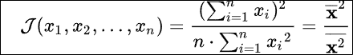
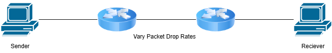
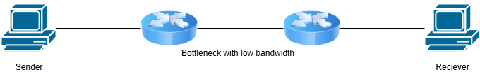
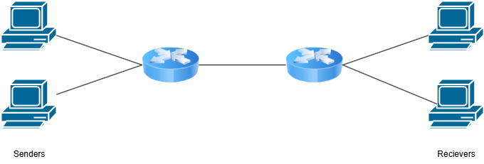
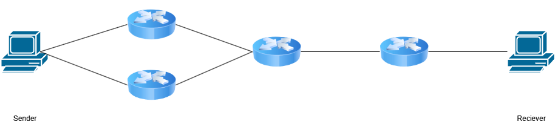
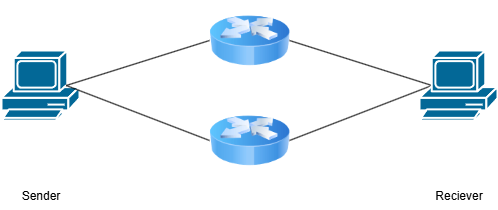
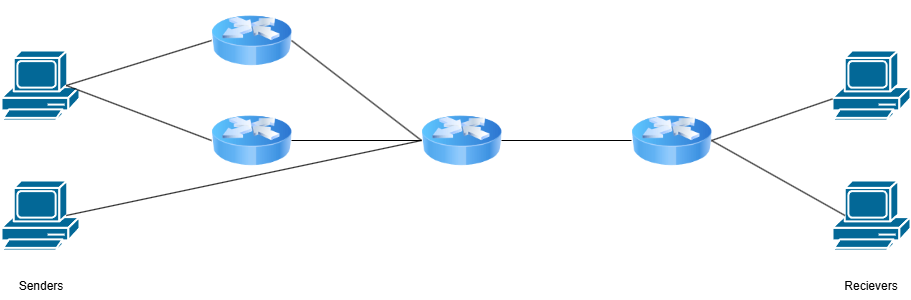

# Congestion Control Evaluation Suite
This is the design document for Congestion Control Evaluation Suite Extension for [NeST](https://gitlab.com/nitk-nest/nest).

This is a benchmarking tool, which we hope will help people to benchmark new congestion control algorithms.

The tool would have a few standard tests, compliant with [RFC 9743](https://datatracker.ietf.org/doc/rfc9743/), and running these tests will output some traces, graphs and statistics. We leave it to the user to interpret these results.

Design goals (looking for comments and suggestions) 
 - The test outcomes must be statistically consistent.
 - Have a way to load in custom implementations of CCAs and not just kernel modules.

The design involves three separate things:
1. [Metrics](#metrics) 
2. [Test Cases](#test-cases)
3. [Test Configurations](#test-configurations)

At the end of this document you will find [questions](#questions) that we would like answers to, from the community. 

*Note: This document is just an initial draft and will keep evolving with help from the community and our own research. Any and all suggestions are welcome and greatly appreciated.*

# Metrics
These are the metrics that we have planned to include in the suite, and are heavily influenced by those outlined in [RFC 5166](https://datatracker.ietf.org/doc/rfc5166/)

## Performance Metrics

### cwnd vs Time 
 - Congestion Window as a function of time.

### Sending Rate vs Time
 - Sending Rate as a function of time.
 - Same as cwnd vs Time during low Congestion.

### Throughput vs Time
 - Router-based: Measured as the aggregate utilization of a link.
 - Flow-based: Measured by the transfer times of individual connections.
 - User-based: Measured by metrics like user wait times or application-specific utility functions

### ssthresh vs Time
 - slow start threshold as a function of time.

### Latency vs Time
 - Router-based: Focusing on Queueing delay over time.
 - Flow-based: Per-packet transfer time.
 - User-based: Total per-packet delay seen by an application including any time spent waiting at the sender and potential delays from retransmitting lost packets

### Number of packet drops vs time
 - Packet loss/Mark rate: raw rate of packets lost or marks by ECN.
 - Congestion event rate: groups one or more lost/marked packets within a single roundtrip into a congestion event.
 - Burst metrics for RTP:
    - burst density: the fraction of packets in bursts
    - gap density: the fraction of packets in the gaps between bursts
    - burst duration: the mean duration of bursts in seconds
    - gap duration: the mean duration of gaps in seconds

### Flow completion Time vs Time
 - The total duration from the moment the first packet of a data flow is sent to the moment the last packet is received

### Qlength vs Time
 - This measuers the number of packets waiting in a buffer (queue) at any given point in time, indicating the level of network congestion.

### Qdelay v​​s Time
 - This measures the time a packet spends waiting in a queue before being processed, illustrating the latency introduced by buffering over time.

### QCapacity vs Time
 - This shows the maximum size or packet-holding capacity of the queue over time.

## Fairness Metrics

### Jain's Fairness vs Time

 - It measures the fairness of resource allocation among a number of users.
 - The index ranges from 0 to 1, where 1 represents a perfectly fair allocation in which all users receive the same share.
 - For n users, where x_i is the throughput for the i-th connection, the index is calculated.

### Product Measure vs Time 
 - Product of individual connection throughputs to evaluate fairness.
 - This measure is particularly sensitive to segregation, as the entire product becomes zero if any single connection receives zero throughput.

### Epsilon Fairness
 - It is Based on the worst-case ratio between flow rates
 - A rate allocation is considered epsilon-fair if the ratio of the minimum throughput to the maximum throughput is at least 1−ϵ.

### HARM Index 
 - Measueres the negative impact a new Congestion Control Algorithm (CCA) has on the performance of existing, deployed CCAs.
 - Harm is measured on a scale from 0 (harmless) to 1 (maximally harmful).
 - Compare a flow's performance when running alone (solo performance, x) to its performance with a competitor (y).
 - Reference: https://www.irtf.org/anrp/IETF109-ANRP-Ware.pdf

### Max-Min Fairness
 - This criterion aims to make the smallest throughput rate as large as possible. After this is achieved, the next-smallest rate is made as large as possible, and so on.
 - This approach gives "absolute priority to the smallest flows"

### Minimum Potential Delay Fairness
 - This metric is considered a model for TCP's behavior and acts as a compromise between max-min and proportional fairness.
 - An allocation meets this standard if it minimizes the sum of the inverse of each flow's throughput
 - This is equivalent to minimizing the average download time if all flows were transferring equal-sized files.
 
# Test Cases
These test cases are designed based on our understanding of RFC 9743. 

The specific line from RFC 9743 that defines these testcases are quoted with them in *italic*.

## Single Algorithm Behavior

### Protection against Congestion Collapse

This test is to see whether the sender will backoff when experiencing high packet drop rates (above 30% according to RFC 3714). Initially, there won’t be any packet drop for a few seconds and then the packer drop is set to 30% in the bottleneck.

*A congestion control algorithm should either stop sending when the packet drop rate exceeds some threshold [RFC3714] or include some notion of "full backoff".*

Metrics (for sender): 
- cwnd vs Time
- Throughput vs Time
- Sending rate vs Time
- ssthresh vs Time
    
### Protection against Bufferbloat

This test is to see if the new CC algorithm can solve the problem of Bufferbloat without the help of AQMs. A FIFO queue should be used everywhere. Low bandwidth of bottleneck will cause the queues to fill up.

*A congestion control algorithm ought to try to avoid maintaining excessive queues in the network.*

Metrics (for sender):
- Latency vs Time
- Throughput vs Time
- Flow completion time
- ssthresh vs Time
- cwnd vs Time
- Sending rate vs Time
    
Metrics (for router) : 
- Qlength vs Time
- Qdelay v​​s Time
- QCapacity vs Time 

### Protection against High Packet Loss

This test is to see if the new CC algorithm reduces its sending rate when facing High Packet Loss. Similar to the above test, the only difference is that AQMs can be used now. 

*A congestion control algorithm needs to avoid causing excessively high rates of packet loss.*

Metrics (for sender) : 
- Latency vs Time
- Throughput vs Time
- Flow completion time
- ssthresh vs Time
- cwnd vs Time
- Sending rate vs Time
    
Metrics (for router) : 
- Qlength vs Time
- Qdelay v​​s Time
- QCapacity vs Time

### Fairness Within the Proposed Congestion Control Algorithm

This test is to see if the new CC algorithm can be fair to each other. The number of end devices can be set.

*When multiple competing flows all use the same proposed congestion control algorithm, the evaluation should explore how the capacity is shared among the competing flows.*

Metric (fairness): 
- Jain’s fairness
- Product measure
- Epsilon fairness
- Harm index
    
Metrics (for sender): 
- Latency vs Time
- Throughput vs Time
- Flow completion time
- ssthresh vs Time
- cwnd vs Time
- Sending rate vs Time
    
### Short Flows

One primary sender will be a long flow, while the other will join later as a short flow (i.e. flows that terminate while in the “slow start” phase).

*A proposal for a congestion control algorithm MUST consider how new and short-lived flows affect long-lived flows, and vice versa.*

Metric (fairness) - btw short and long flows: 
- Jain’s fairness
- Product measure
- Epsilon fairness
- [Harm index](https://www.irtf.org/anrp/IETF109-ANRP-Ware.pdf) 
    
Metrics (for sender):  
- Latency vs Time
- Throughput vs Time
- Flow completion time
- ssthresh vs Time
- cwnd vs Time
- Sending rate vs Time
    
Metrics (for router) : 
- Qlength vs Time
- Qdelay v​​s Time
- QCapacity vs Time

## Mixed Algorithm Behavior

### Existing General Purpose CC Algorithms

Similar to the “Fairness within Proposed CC Algorithm” test. The only difference is to use end devices with different CC algorithms (such as Reno, Cubic, BBR, etc) along with the new CC algorithm. 

*A proposed congestion control algorithm MUST be evaluated when competing against standard IETF congestion controls (e.g., [RFC5681], [RFC9002], and [RFC9438]).*

Metric (fairness):  
- [Harm index](https://www.irtf.org/anrp/IETF109-ANRP-Ware.pdf)
    
Metrics (for sender): 
- Latency vs Time
- Throughput vs Time
- Flow completion time
- ssthresh vs Time
- cwnd vs Time
- Sending rate vs Time
    
Metrics (for router): 
- Qlength vs Time
- Qdelay v​​s Time
- QCapacity vs Time 
    
### Real-Time Congestion Control
 

Similar to the above test, but one of the sender runs a real-time congestion control algorithm.

*A proposal for a congestion control algorithm SHOULD consider coexistence with widely deployed real-time congestion control algorithms.*

### Short and Long Flows

Same as the “Short Flows” test, but this time the short and long flows should be the new CC algorithm and existing CC algorithms and vice versa.

*The effect on short-lived and long-lived flows using other common congestion control algorithms MUST be evaluated.*

Metric (fairness): 
- [Harm index](https://www.irtf.org/anrp/IETF109-ANRP-Ware.pdf) 
    
Metrics (for sender):  
- Latency vs Time
- Throughput vs Time
- Flow completion time
- ssthresh vs Time
- cwnd vs Time
- Sending rate vs Time
    
Metrics (for router) : 
- Qlength vs Time
- Qdelay v​​s Time
- QCapacity vs Time

## Multipath Tests

### Failover Multipath

In this test, the multipath algorithm follows Failover mechanism, where it switches to another path when the working path fails. We remove the working router after some time and see how the algorithm responds.

This can be another version of the test where the multiple paths do not share a common bottleneck.

*Authors of a proposed multipath congestion control algorithm that implements path failover MUST evaluate the harm to performance resulting from a change in the path and show that this does not result in flow starvation.*

### Concurrent Multipath

In this test, we test if the new CC algorithm will be fair to another flow when it is sharing a bottleneck with a multipath flow.

*A congestion control algorithm proposal MUST evaluate the potential harm to other flows when the multiple paths share a common congested bottleneck or share resources that are coupled between different paths, such as an overall capacity limit. A proposal SHOULD consider the potential for harm to other flows.*

# Test Configurations

## CC Algorithm
The CC Algorithm to be tested. (Mandatory)

## Link Configurations
Each environment such as Wired, Wireless, Satellite, etc will have default presets for link configuration values such as Latency, Bandwidth, Packet Drop Rate, etc. 

These are default values, and it is recommended that the user configures these themselves.

| Environment            | Bandwidth | RTT     | Packet Drop Rate | Packet Reordering Probability | Packet Reordering Distance |
| ---------------------- | --------- | ------- | ---------------- | ----------------------------- | -------------------------- |
| Wired Path             | 1 Gbps    | 1 ms    | 0 %              |                               |                            |
| Wireless Path          | 1 Gbps    | 12 ms   | 0.0477 %         |                               |                            |
| High Delay / Satellite |           | 500 ms  |                  |                               |                            |
| Data Center            | 10 Gbps   | 0.25 ms | 0 %              |                               |                            |
| IOT                    |           |         |                  |                               |                            |

*The values mentioned above are per link.*

## Queue Management Algorithms
Default is FQ_CoDel, but can be configured by the user.

## Number of End Devices
Some tests have multiple end devices on either side of the bottleneck. The default is 2, but can be configured by the user.

# Questions

## Questions specific to the design documents
- What is a suitable value for epsilon in epsilon fairness? - [Epsilon Fairness](#epsilon-fairness)

- How to go about testing Real-time congestion control? Apparently, RTCP is not implemented in the Linux kernel yet. - [Real-Time-Congestion-Control](#real-time-congestion-control)

- What CCA should we run on QUIC? - [Existing General Purpose CC Algorithms](#existing-general-purpose-cc-algorithms)

- What should be the default link configuration values we use for different environments and is there any other default environment that we should add? - [Link Configurations](#link-configurations)

## General Questions

- Regarding varying delay:
    1. Create a new testcase to test how the CCA performs with varying delay. 
    2. Create a new default link configuration which will cause varying delay.
    3. All link configurations should cause varying delay.

- Any suggestions regarding testing for CCA made for IOT.

- Any suggestions for tests for paths with VPN tunneling.

- Any suggestions for metrics that we have not mentioned that should be added to the suite or to any specific test case.

- RFC 9743 mentions network circuit breakers. Should this be a standalone test? Or we could just measure if packet drop rate ever goes above 10%.

- In some of the tests there are multiple devices that act as senders. Should there be a version of those tests in which 1 device sends multiple flows instead?
